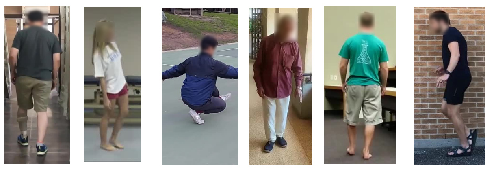
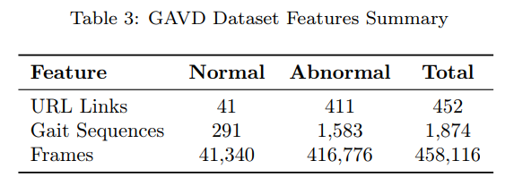
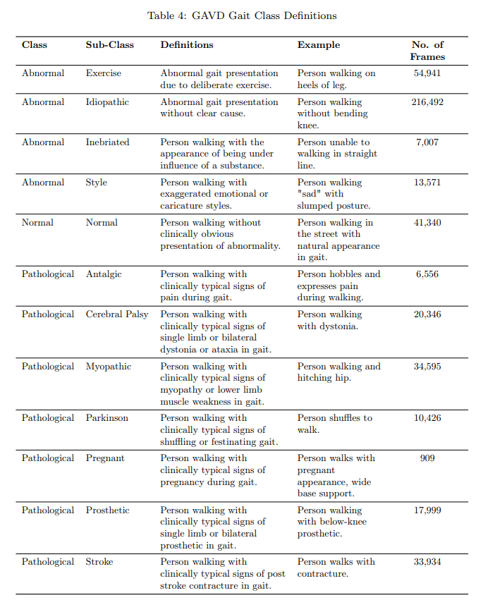
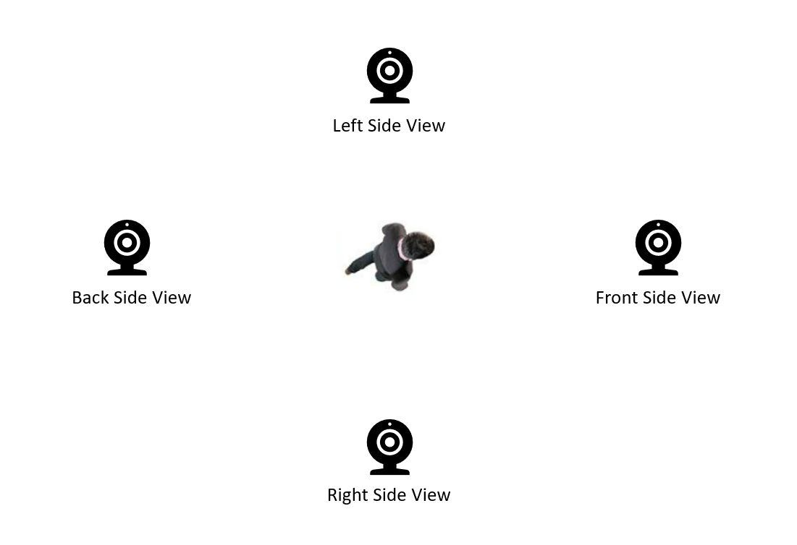
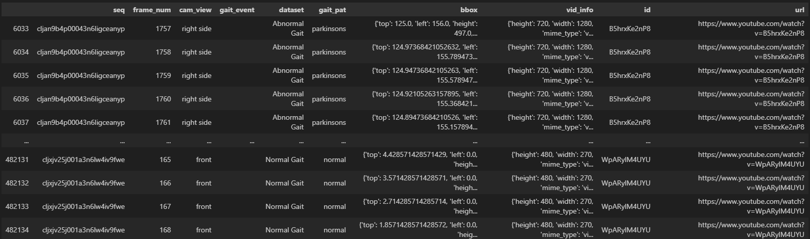

# GAVD
Gait Abnormality in Video Dataset (GAVD) is the largest collection of online links to gait videos with clinical annotations. The dataset is designed for Clinical Gait Analysis using computer vision however has many applicaitons such as gait recognition and abnormality action detection. For further details regarding dataset please see [LINK TO PAPER IN ARXIV]

## Dataset Features

## Data Structure
Data is provided as pkl files part 1 to 5 or csv files part 1 to 5.

|*Data Column*|*Description*|
|:-----------------:|:--------:|
| seq |   sequnce ID unique to a section of gait in single direction  |

seq - sequnce ID unique to a section of gait in single direction
frame_num - corresponding frame number of video
cam_view - Annotated person-centric view
gait_event - clinically annotated gait event (NOTE: this is limited in this current dataset)
dataset - general classificaiton of normal and abnomral gait
gait_pat - clinically annotated classification of gait from observation by clinican
bbox - bounding box values tracking indiviuals gait
vid_info - video related metadata
id - video youtube id
url - url to access video

